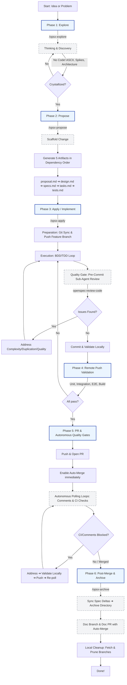
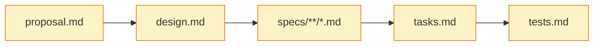
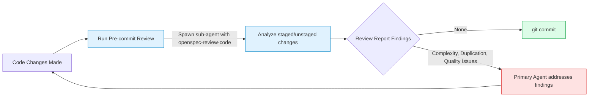
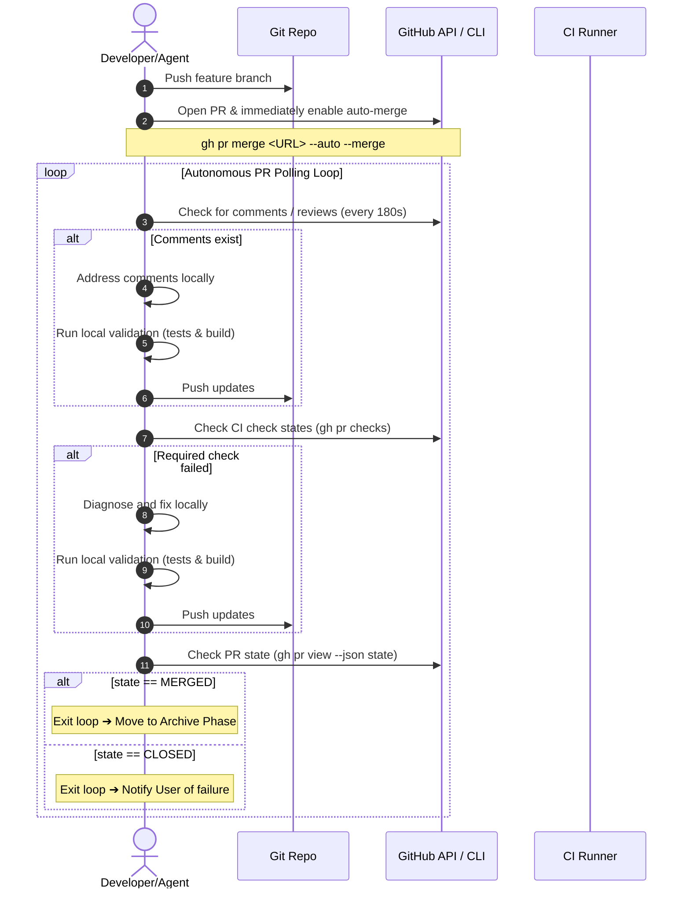

# OpenSpec Spec-Driven Development Workflow Guide

This document outlines the standard Spec-Driven Development (SDD) workflow using the custom **`sdd-with-feedback-loop`** schema. 

This workflow provides a strict, feedback-driven pipeline designed to establish a **Single Source of Truth** for planning, design, specs, tasks, implementation, and quality assurance. It is built to be easily understood by human developers while providing explicit, machine-readable rules and commands that AI coding agents can execute autonomously.

---

## High-Level Workflow Overview

The lifecycle of a code change progresses through six distinct phases. The flow is iterative: feedback from local pre-commit reviews, validation failures, or PR reviews will loop execution back to earlier phases as needed to maintain high quality.



---

## Detailed Phase Guide

### Phase 1: Explore (`/opsx-explore`)

**Stance**: Curious, open-threaded, visual, patient, and grounded. 
**Objective**: Understand the problem space, mapping integration points in the codebase, researching choices, and listing risks and unknowns.

> [!WARNING]
> **Explore mode is strictly for thinking, not implementing.** Under no circumstances should application code be written or modified in this phase. The only files that may be created are conceptual notes or ASCII architecture diagrams.

*   **Action**: Use `/opsx-explore` followed by a vague idea, specific problem, or target capability.
*   **Codebase Inspection**: Check for active context using:
    ```bash
    openspec list --json
    ```
*   **Visualizing**: Leverage ASCII diagrams to map dependencies, state transitions, or database layouts.
*   **Transition**: When the shape of the change crystallizes, transition to the proposal phase.

---

### Phase 2: Propose (`/opsx-propose`)

**Objective**: Generate the 5 core implementation artifacts in strict dependency order, ensuring that all architectural details, edge cases, BDD acceptance scenarios, and testing plans are locked in before writing code.



#### Step-by-Step Generation Flow

1.  **Create the change's dedicated worktree, then initialize the change**:
    ```bash
    git fetch origin
    git worktree add ".worktrees/<change-name>" -b "<change-name>" "origin/<default-branch>"
    git push -u origin "<change-name>"
    cd ".worktrees/<change-name>"
    openspec new change "<change-name>"
    ```
    This scaffolds the directory `openspec/changes/<change-name>/` with `.openspec.yaml`. Every artifact and, later, every implementation change for this change lives inside `.worktrees/<change-name>` — never in the primary checkout. This lets multiple agents propose and implement different changes from the same repo clone at the same time. Reuse the worktree instead of recreating it if one already exists (e.g. started during an explore session).

2.  **Generate Core Artifacts**:
    Run `openspec status --change "<change-name>" --json` to read the build order, and iteratively create the following files under `openspec/changes/<change-name>/`:

    *   **`proposal.md`**: Outlines *why* the change is needed, the problem space (current vs desired behavior, edge cases, assumptions), in/out scope boundaries, risks, open questions, and non-goals.
        *   *Change Control Note*: Include a statement that if the scope changes during implementation, all artifacts must be updated and re-approved before proceeding.
        *   *Approval*: Normally the proposal requires explicit human approval before design/specs/tasks proceed. The exception: if the change started with explore mode, every open question raised there was resolved, and the user then explicitly says to proceed with the proposal, that instruction counts as approval — continue straight through design, specs, and tasks without an extra pause.
        *   *Task Assignment*: If this is issue-driven, assign the issue to the current owner.
    *   **`design.md`** (Requires `proposal`): Technical design mapping the proposal to implementation decisions. Includes architectural touchpoints, goal/non-goal mappings, architectural decisions (ADRs), functional & non-functional requirement mappings, rollback plans, and an operational blocking policy.
    *   **`specs/**/*.md`** (Requires `proposal`, `design`): Capability specifications detailing exact behavior changes.
        *   Use `ADDED`, `MODIFIED`, and `REMOVED` sections.
        *   Document acceptance criteria strictly using BDD scenarios (**Given / When / Then**).
        *   Ensure explicit traceability back to `design.md` requirements.
    *   **`tasks.md`** (Requires `specs`): The complete, sequential checklist of activities. Must cover: Preparation, Execution, Pre-Commit Code Review, Validation, PR and Merge, and Post-Merge.
    *   **`tests.md`** (Requires `tasks`): Strict test-driven cases mapped directly to tasks in `tasks.md` and acceptance scenarios in `specs/**/*.md`.

> [!IMPORTANT]
> When generating artifacts, `context` and `rules` provided by the schema are **constraints for the author (or agent)**, not contents to copy-paste. Never leave raw template instructions or boilerplate markers inside the generated markdown documents.

---

### Phase 3: Apply / Implementation (`/opsx-apply`)

**Objective**: Execute the checklist in `tasks.md` sequentially, applying BDD/TDD practices and enforcing code quality via an autonomous pre-commit review.

#### 1. Preparation
Before making code changes, enter the change's dedicated worktree (created during propose):
```bash
git worktree list                              # confirm .worktrees/<change-name> exists
cd .worktrees/<change-name>
```
If it doesn't exist yet — for example the change predates this convention, or was created manually — create it from the primary checkout first:
```bash
git fetch origin
git worktree add .worktrees/<change-name> -b <feature-branch-name> origin/<default-branch>
git push -u origin <feature-branch-name>
cd .worktrees/<change-name>
```
Never `git checkout` a different branch in the primary checkout to do this work — that would disrupt any other agent or human using that checkout concurrently.

#### 2. Execution (BDD/TDD Loop)
For each task:
1.  **Red**: Write a failing test in the test suite that captures the behavior.
2.  **Green**: Write the minimal code necessary to make the test pass.
3.  **Refactor**: Clean up implementation, reuse existing helpers/modules, and eliminate redundancy.
4.  **Mark**: Check off the task in `tasks.md` (`- [ ]` ➔ `- [x]`).

#### 3. The Pre-Commit Quality Gate
Before creating **every commit**, a dedicated quality review must run to keep the code clean and prevent technical debt:



1.  **Spawn Sub-Agent**: Run the `openspec-review-code` skill. This automatically compares changes against the default branch:
    ```bash
    git diff <default-branch>...HEAD
    git diff HEAD
    ```
2.  **Analyze Report**: The sub-agent outputs a structured report detailing:
    *   *Complexity Issues*: Overly complex logic with suggested simpler structures.
    *   *Duplication Issues*: Spotting repeated code or missing opportunities to reuse existing functions.
    *   *Quality Issues*: Bad naming, unclear control flow, or potential bugs.
3.  **Automatic Resolution**: The primary agent **must address all findings** in the report, adjusting the codebase locally before committing.

---

### Phase 4: Local Validation

Prior to pushing any commits to the remote branch or staging them for a Pull Request, you must execute the project's local validation suites. 

> [!CAUTION]
> If **ANY** of the following validation steps fail, you **MUST NOT** push. You must iterate locally to resolve the failures:
> - **Unit Tests**: Project test suite must pass with 100% success.
> - **Integration / E2E Tests**: Integration and regression tests must pass.
> - **Build**: Production and development build scripts must succeed with zero errors/warnings.

---

### Phase 5: PR, Merge & Autonomous Quality Gates

Once local validation is green, push the changes and open the Pull Request. The agent will then transition into an autonomous monitoring and resolution loop until the PR successfully merges.



#### PR Life Cycle Rules

1.  **Open PR**: Open a PR from the working branch to `<default-branch>`. If the proposal was issue-driven, write `Closes #N` explicitly in the PR body.
2.  **Enable Auto-Merge**: **Immediately** run:
    ```bash
    gh pr merge <PR-URL> --auto --merge
    ```
    *Never* use `--admin` or force-merge. Allow quality gates to pass naturally.
3.  **Comment Resolution Loop**:
    *   Poll for new PR comments every 180 seconds.
    *   When feedback is left, address it immediately in the code, run local validation, commit, and push.
    *   Ensure all comment threads are marked resolved to unblock the merge.
4.  **CI Check Resolution Loop**:
    *   Poll for CI check statuses using:
        ```bash
        gh pr checks <PR-URL> --json isRequired,state
        ```
    *   If a required check fails, diagnose the problem, write a local fix, run local validation, and push.
5.  **Merge Polling**:
    *   Check the state of the PR:
        ```bash
        gh pr view <PR-URL> --json state
        ```
    *   Once `state` becomes `MERGED`, break the loop and proceed to archiving. If it becomes `CLOSED` without a merge, halt and request human assistance.

---

### Phase 6: Post-Merge & Archive (`/opsx-archive`)

Once your feature PR is merged, the change must be synchronized, spec changes made global, local workspaces cleaned, and the change directory archived.

#### 1. Sync & Pull
Switch to the default branch and pull down the merged commit:
```bash
git checkout <default-branch>
git pull --ff-only
```

#### 2. Spec Delta Synchronization
Sync any approved delta specifications from `openspec/changes/<change-name>/specs/` into the global, single-source-of-truth spec directory: `openspec/specs/<capability>/spec.md`.

#### 3. Archive in a Single Commit
Move the change directory into the archives.
```bash
mkdir -p openspec/changes/archive
mv openspec/changes/<change-name> openspec/changes/archive/YYYY-MM-DD-<change-name>
```

> [!IMPORTANT]
> **Stage the move together.** You must add the archived directory and stage the deletion of the active changes directory *in a single commit* to keep Git history clean.
> ```bash
> git add openspec/changes/archive/YYYY-MM-DD-<change-name>/ openspec/specs/
> git rm -r openspec/changes/<change-name>/
> git commit -m "docs: archive <change-name> (YYYY-MM-DD)"
> ```

#### 4. Open a Doc PR (Never Push Directly to Default Branch)
To keep branching strict, push these archival and spec-sync changes through a dedicated documentation branch and PR:
```bash
git checkout -b doc/archive-YYYY-MM-DD-<change-name>
git push -u origin doc/archive-YYYY-MM-DD-<change-name>

gh pr create \
  --base <default-branch> \
  --head doc/archive-YYYY-MM-DD-<change-name> \
  --title "docs: archive <change-name> (YYYY-MM-DD)" \
  --body "Archives completed change **<change-name>** and syncs delta specs to main specs."
```
*Immediately enable auto-merge* on this doc PR (`gh pr merge <DOC-PR-URL> --auto --merge`) and monitor it until it is merged.

#### 5. Worktree and Local Branch Cleanup
Once both the implementation PR and the doc PR are merged, remove the change's dedicated worktree and prune local branches to keep the workspace clean:
```bash
git worktree remove .worktrees/<change-name>
git fetch --prune
git branch -d <feature-branch-name> doc/archive-YYYY-MM-DD-<change-name>
```

---

## Agent Instructions & Reference

When acting as an AI coding agent, treat the following rules as high-priority instructions:

### 1. General Principles
*   **Phase Discipline**: Never write application code during the **Explore** phase. Never write code during the **Propose** phase. Implement *only* during **Apply**.
*   **No Placeholders**: When scaffolding templates or writing code, never write comments like `// TODO: implement` or placeholder texts. Every artifact must contain fully fleshed-out details.
*   **Traceability**: Every acceptance criteria scenario in `spec.md` must link back to requirements in `design.md`, and must map to a specific checkbox task in `tasks.md`.

### 2. Pre-Commit Review Execution
Before executing `git commit` on the implementation branch, you **MUST**:
1. Spawn the `openspec-review-code` sub-agent.
2. Read the review report findings.
3. Automatically apply code edits to resolve any identified complexity, duplication, or quality issues.
4. Only commit once the pre-commit review report has zero new findings (or you've resolved all actionable ones).

### 3. PR Auto-Merge and Polling Loop
When opening any PR:
1. Run `gh pr merge <PR-URL> --auto --merge` immediately.
2. Schedule a cron or timer (e.g. `DurationSeconds=180` or recurring schedule) to poll for comments and CI status. Do not run blocking infinite terminal loops; yield control back, and let the system wake you up when notifications arrive or intervals trigger.
3. Actively fix failed required CI checks and reply to PR reviews on the branch, following local validation rules before each push.
